#  Airline Management System

A full-stack relational database system for airline booking management  built with Oracle Database, Oracle APEX, and PL/SQL. Features flight search, automated ticket generation, baggage/payment handling, and a role-based admin dashboard.

---

##  About the Project

Small travel agencies and local airline counters in Pakistan often rely on paper records or basic spreadsheets to manage flight bookings, leading to inefficiencies in tracking passengers, booking history, and flight schedules.

**This project solves that by providing:**
- Easy searching of available flights between Pakistani cities
- Quick booking creation with automatic ticket number generation
- Booking history for returning customers
- Simple user registration and authentication

---

##  Features

**Customer Module**
- User Registration & Login
- Search Flights
- Book Flight (seat selection, meal preference, baggage)
- Payment (simulated)
- Ticket Generation & View

**Admin Module**
- Login
- Add Airlines / Airports / Flights
- Manage Flight Schedules
- View Bookings & Payments
- Update Flight Status

---

##  Tech Stack

- Oracle Database
- Oracle APEX
- PL/SQL & SQL
- ERDPlus (for ER diagrams)

---

##  Database Design

- ER Diagram
- Normalization (1NF → 3NF)
- 13 core tables with PK/FK relationships
- Primary Key, Foreign Key, Unique, Check, and Default constraints

📎 See [`Erd.png`](./Erd.png) and [`Normalization.pdf`](./Normalization.pdf) for details.

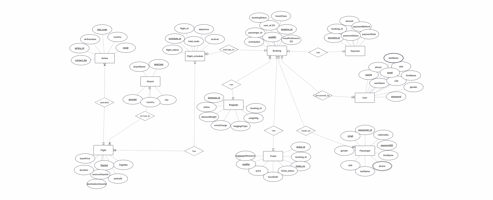

### Tables

| Table | Purpose |
|---|---|
| `airlines` | Airline information |
| `airports` | Airport details |
| `flights` | Flight information |
| `flight_schedule` | Departure/arrival timings |
| `people` | Personal details |
| `users` | Login credentials |
| `passengers` | Passenger details |
| `bookings` | Booking records |
| `tickets` | Ticket information |
| `payments` | Payment information |
| `baggage` | Baggage records |
| `booking_payments` | Links bookings and payments |
| `baggage_payments` | Excess baggage charges |

### Key Relationships
- Airline → operates → Flights
- Flights → depart/arrive → Airports
- Flight Schedule → belongs to → Flight
- Bookings → made by → Users, for → Passengers
- Bookings → generate → Tickets, Payments, Baggage

---

##  Project Workflow

```
User Registration → Login → Search Flights → Select Flight
→ Booking → Payment → Ticket Generation
```

---

##  SQL Features Used

✔ DDL & DML &nbsp;•&nbsp; ✔ Joins &nbsp;•&nbsp; ✔ Constraints &nbsp;•&nbsp; ✔ Sequences  
✔ PL/SQL Procedures & Functions &nbsp;•&nbsp; ✔ Triggers &nbsp;•&nbsp; ✔ Exception Handling &nbsp;•&nbsp; ✔ Transactions (COMMIT/ROLLBACK)

---

##  Repository Structure

```
AIRLINE-MANAGEMENT-SYSTEM-/
│
├── README.md
├── Erd.png
├── Normalization.pdf
│
├── SQL/
│   ├── tables.sql
│   ├── sampledata.sql
│   ├── Sequence.sql
│   ├── processes.sql
│   ├── triggers.sql
│   ├── queries.sql
│   └── Airline_Management_System.sql   (combined/full script)
│
└── screenshots/
    ├── loginpage_customerlogin.jpeg
    ├── loginpage_adminlogin.jpeg
    ├── signup page.png
    ├── Customer_HomePage.jpeg
    ├── Customer_FlightSearch.jpeg
    ├── Customer_BookFlight.jpeg
    ├── Customer_ViewTicket.jpeg
    ├── Admin_HomePage.jpeg
    ├── Admin_Airlines.jpeg
    ├── Admin_Airports.jpeg
    ├── Admin_Flights.jpeg
    └── Admin_FlightSchedule.jpeg
```

---

##  Installation

1. Clone the repository
   ```bash
   git clone https://github.com/NoorFatimaAhsan/AIRLINE-MANAGEMENT-SYSTEM-.git
   ```
2. Run `SQL/tables.sql` to create all tables
3. Run `SQL/sampledata.sql` to insert sample records
4. Run `SQL/Sequence.sql` to create sequences (auto-starts after existing sample data)
5. Run `SQL/processes.sql` to create the `custom_auth` authentication function
6. Run `SQL/triggers.sql` to create triggers
7. Import the Oracle APEX application (`.sql` export file)
8. Run the application from Oracle APEX

---

##  Screenshots

<details>
<summary>Click to expand</summary>

### User Interface

| Customer Login | Sign Up | Home Page |
|---|---|---|
| 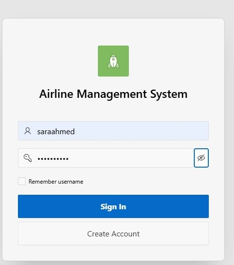 |  | 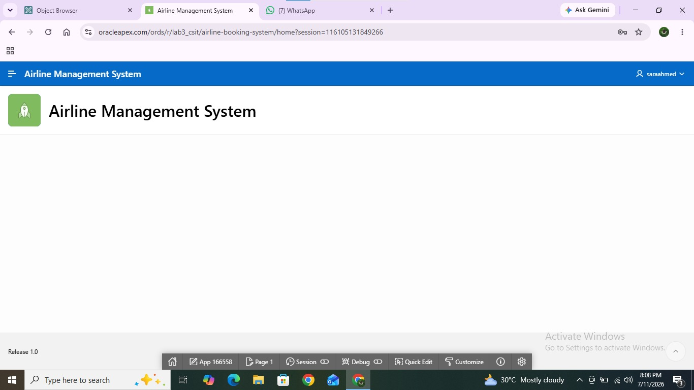 |

| Flight Search | Book Flight | View Ticket |
|---|---|---|
| 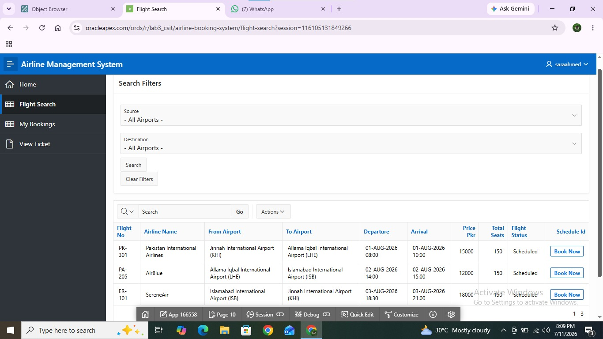 | 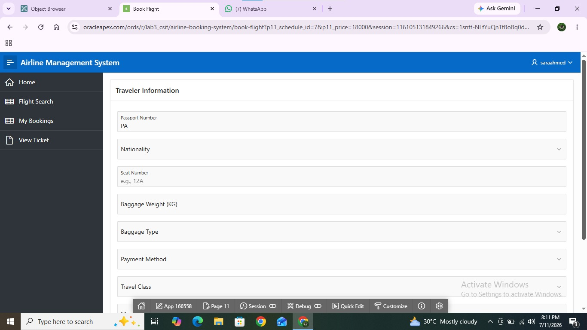 | 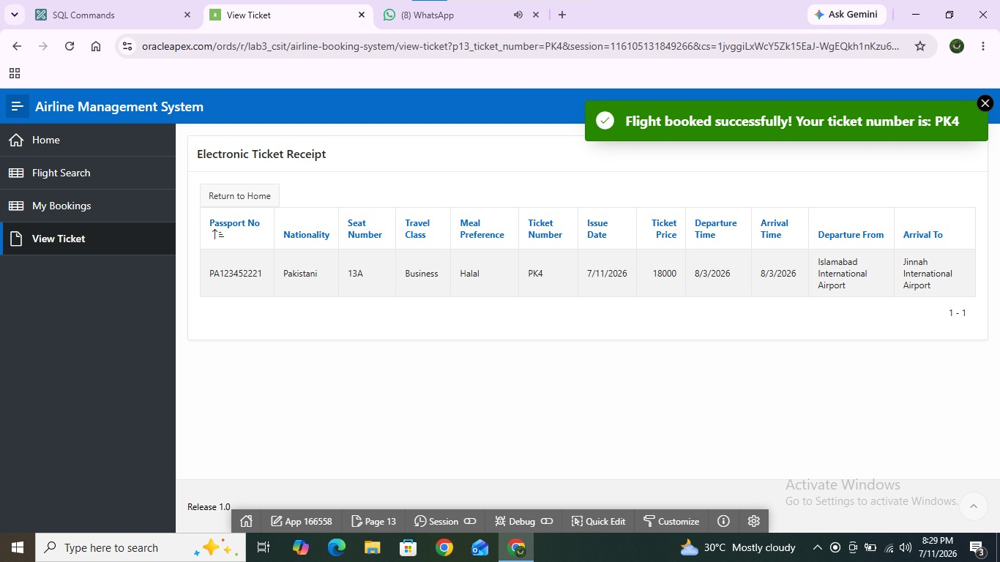 |

### Admin Dashboard

| Admin Login | Admin Home | Manage Flights |
|---|---|---|
| 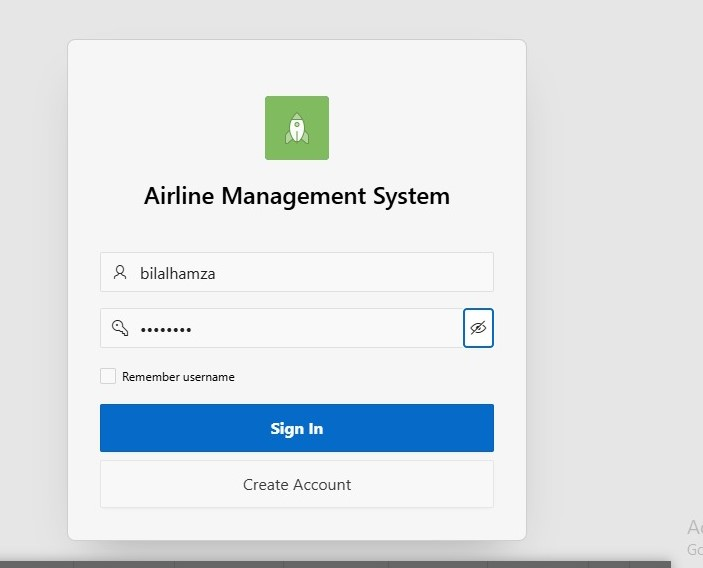 | 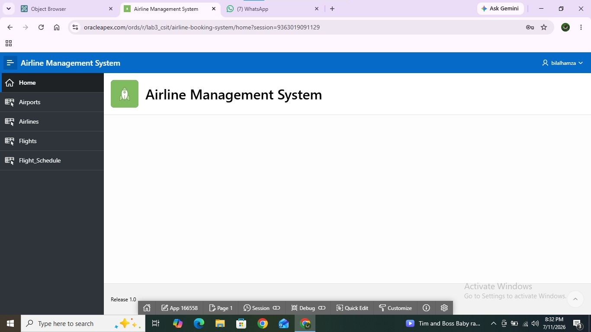 | 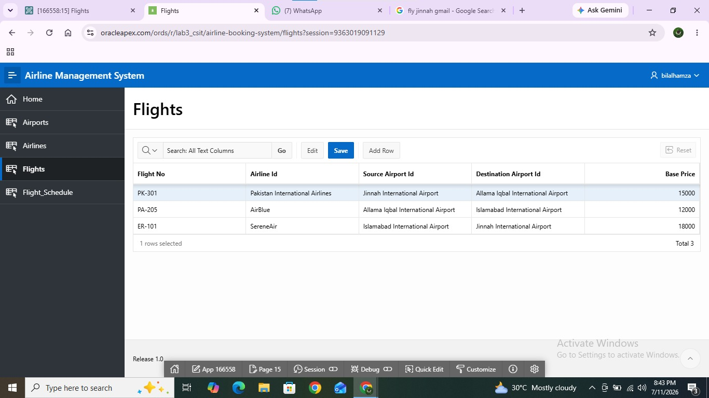 |

| Manage Airlines | Manage Airports | Manage Schedule |
|---|---|---|
| 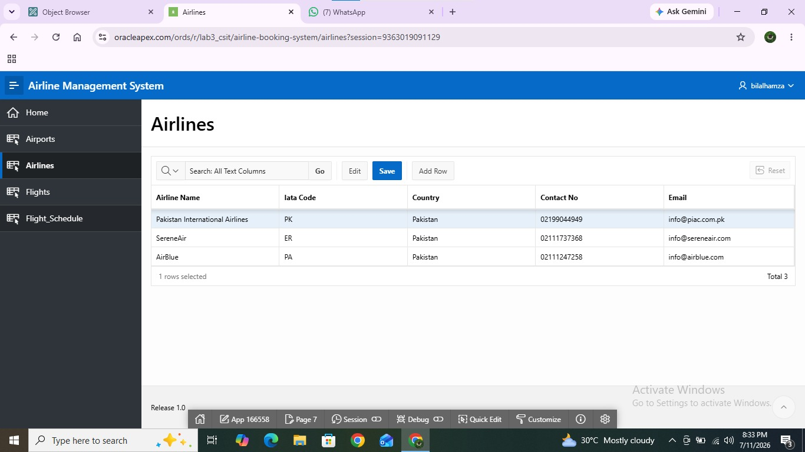 | 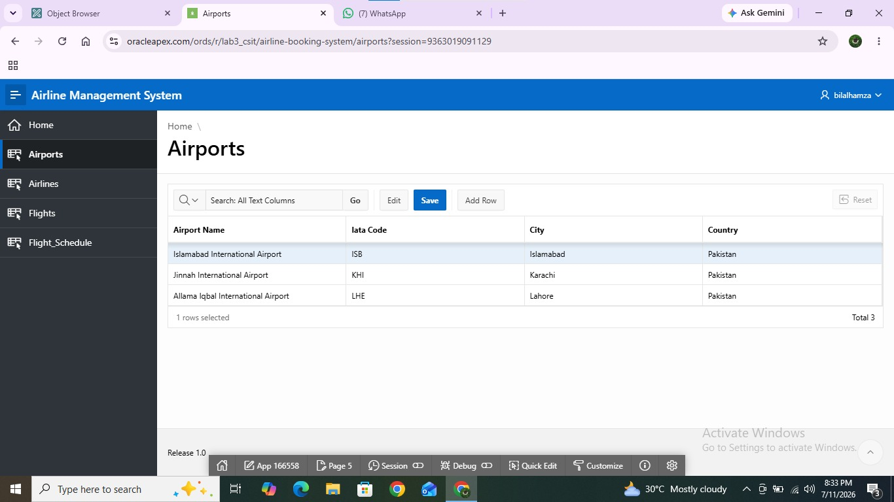 | 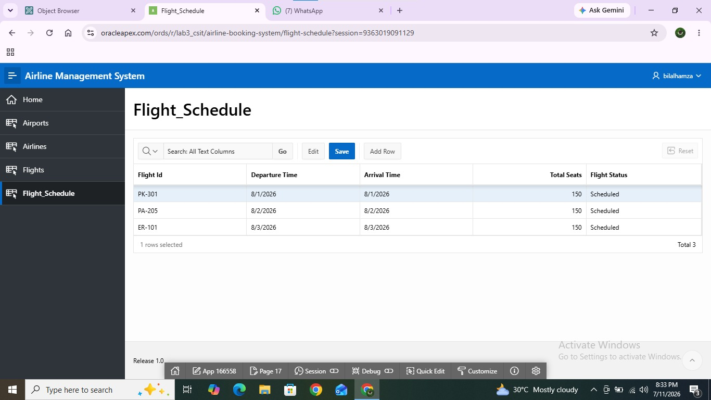 |

</details>

---

##  Future Improvements

- Integration with online payment gateways
- Real-time flight status updates
- Mobile app interface for customers
- Email notifications
- QR code tickets

